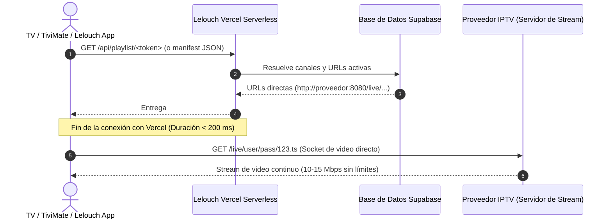

# Arquitectura de Streaming Directo: NO Hacer Proxy de Videos por Vercel

> **Documento de Arquitectura de Red y Rendimiento — FASE 21**  
> **Proyecto:** Lelouch IPTV & Web Player  
> **Ámbito:** Backend Serverless (`/api/playlist`), Generación de Playlists M3U y Reproductores Nativos  

---

## 1. El Principio Fundamental

> **"Lelouch publica la playlist, no retransmite el vídeo."**

Lelouch actúa como un **Publicador y Sincronizador Inteligente de Metadatos y Playlists M3U**. Su función es catalogar, versionar, filtrar y distribuir la estructura de canales hacia los dispositivos del usuario. **Bajo ninguna circunstancia** la infraestructura Serverless de Vercel debe intermediar los flujos continuos de video (MPEG-TS, HLS, MP4) dirigidos a televisores, decodificadores o reproductores externos.

---

## 2. Diagrama de Flujo: Arquitectura Correcta vs Incorrecta

### ✅ Arquitectura Correcta (Implementada en Lelouch)

```
TV / Dispositivo
 │
 │ 1. Descarga playlist ligera (M3U de unos cuantos KB/MB)
 ▼
LELOUCH VERCEL (/api/playlist/TOKEN)
 │
 │ 2. Devuelve texto #EXTM3U o JSON manifest con URLs directas
 ▼
TV / Dispositivo
 │
 │ 3. Solicita flujo de video directo (10-15 Mbps)
 ▼
PROVEEDOR IPTV (Servidor de Streaming)
```



---

### ❌ Arquitectura Incorrecta (Estrictamente Rechazada)

```
PROVEEDOR IPTV
      │
      ▼
   VERCEL  <-- [ERROR CRÍTICO: Proxy de video continuo de 10 Mbps]
      │        - Agota ancho de banda mensual en horas
      │        - Timeout forzado de Serverless (10s - 60s)
      ▼        - Caídas constantes de streaming y buffering
TV / Dispositivo
```

---

## 3. Justificación Técnica: Por qué el Proxy de Video por Vercel es Inviable

| Dimensión | Conexión Directa al Proveedor (Correcta) | Proxy de Video por Vercel (Incorrecta) |
| :--- | :--- | :--- |
| **Consumo de Ancho de Banda** | **Cero** bytes de video pasan por Vercel. Solo unos pocos KB de texto de la playlist. | **Masivo**. Un canal HD/4K a 10 Mbps consume **4.5 GB por hora**. Una sola TV encendida 3 horas/día consume **405 GB/mes**, sobrepasando de inmediato la cuota de Vercel. |
| **Límites de Tiempo (Timeouts)** | Conexión de red persistente indefinida entre TV y proveedor. | Las funciones Serverless tienen un límite estricto de ejecución (**10 segundos** en Hobby, máximo **60 segundos** en Pro). El video se cortaría cada 60 segundos. |
| **Latencia de Reproducción** | Latencia mínima punto a punto (TV $\leftrightarrow$ Proveedor). | Salto intermedio adicional que añade entre **150 ms y 400 ms** de latencia innecesaria. |
| **Límites de Memoria y Concurrencia** | El servidor del proveedor gestiona las conexiones concurrentes del abonado. | Cada conexión simultánea consume memoria de función y sockets abiertos en Vercel, provocando errores `504 Gateway Timeout` y `429 Too Many Requests`. |
| **Coste Económico** | **$0.00** en ancho de banda de video para el proyecto. | Miles de dólares en cobros por exceso de ancho de banda Edge ($40 por cada 100 GB adicionales en Vercel). |

---

## 4. Salvaguardas Implementadas en el Código

1. **Desempaquetado Automático en `api/playlist.js`:**
   La función `ensureDirectProviderUrl(url)` verifica cada URL antes de incluirla en `#EXTM3U` o en el manifest JSON. Si detecta cualquier prefijo de proxy (`/api/proxy?target=...`), lo desenvuelve para garantizar que el cliente siempre reciba la URL cruda y directa al proveedor.
2. **Serialización Directa en `PlaylistGenerator` (`.js` y `.ts`):**
   La función exportada `unwrapProxyUrl(url)` garantiza que los métodos `convertToParserPlaylist()`, `generateM3U()` y `generateManifestJson()` entreguen enlaces directos al servidor de streaming.
3. **Ámbito Restringido de `api/proxy.js`:**
   El endpoint `/api/proxy.js` está etiquetado y restringido exclusivamente como mecanismo de soporte para el navegador web de escritorio/móvil cuando este requiere saltarse restricciones de *Mixed Content* (HTTPS $\rightarrow$ HTTP) o CORS en modo debug. **Nunca** se distribuye en playlists dirigidas a TVs o reproductores externos.
