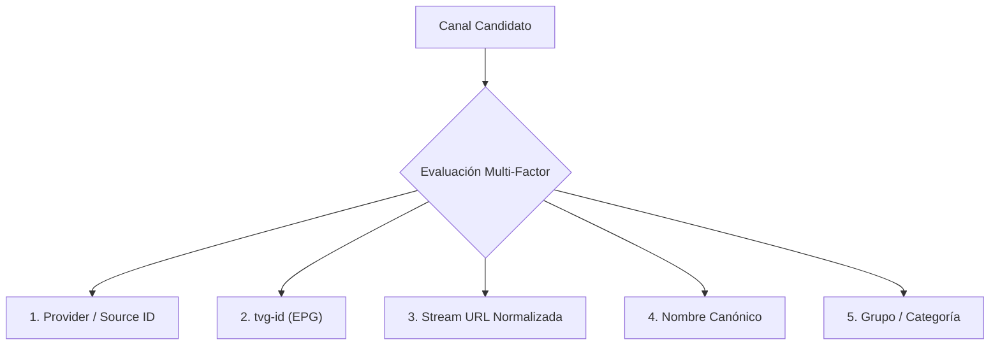

# Política de Deduplicación Inteligente Multi-Factor

> **Documento de Especificación y Algoritmos — FASE 23**  
> **Proyecto:** Lelouch IPTV & Web Player  
> **Componente:** `PlaylistDeduplicator` (`.js` / `.ts`)  

---

## 1. El Problema: El Riesgo de Deduplicar Únicamente por Nombre

En entornos multi-proveedor IPTV es habitual encontrarse con escenarios como el siguiente:

```text
Fuente A ──► "Canal X" (ej. ESPN 1080p Servidor USA)
Fuente B ──► "Canal X" (ej. ESPN 720p Servidor Backup Europa)
Fuente C ──► "Canal Y" (ej. HBO HD)
```

Si el reproductor o generador de playlists asume de forma simplista que dos elementos son duplicados **únicamente porque coinciden en su nombre**:
* Se elimina arbitrariamente una de las dos fuentes de *Canal X*.
* Se pierde la posibilidad de tener un canal de respaldo si la Fuente A experimenta buffering o caídas.
* Se pueden mezclar canales regionales homónimos pero con contenidos totalmente distintos (ej. *ESPN México* vs *ESPN Argentina*).

Por lo tanto, la regla de oro de Lelouch es:

> **"Nunca se debe decidir automáticamente que dos canales son idénticos únicamente por su nombre."**

---

## 2. Los 5 Factores Deterministas de Lelouch

El motor de deduplicación de Lelouch evalúa una tupla de **5 factores técnicos complementarios**:



| Factor | Propósito | Tratamiento Técnico |
| :--- | :--- | :--- |
| **1. Provider / Source** | Aislamiento de fuentes | Identifica si los canales pertenecen al mismo proveedor o provienen de cuentas/listas independientes. |
| **2. tvg-id** | Identidad de programación | Código único internacional en la guía EPG (ej. `ESPN.us`, `HBO.latam`). |
| **3. Stream URL Normalizada** | Huella técnica del stream | Se eliminan tokens dinámicos (`token`, `auth`, `sid`, `session_id`), credenciales (`/live/user/pass/`) y puertos estándar para comparar el destino físico real. |
| **4. Nombre Canónico** | Comparación textual | Normalización NFD para eliminar diacríticos/acentos y caracteres especiales (`normalizeString`). |
| **5. Grupo / Categoría** | Contexto semántico | Distingue canales con nombres parecidos en categorías distintas (ej. *Deportes* vs *Cine*). |

---

## 3. Matriz de Decisión de Deduplicación

| Fuente | Nombre | Stream URL Normalizada | tvg-id | Decisión Lelouch | Razón Técnica |
| :---: | :---: | :---: | :---: | :---: | :--- |
| **Misma** | Idéntico | Idéntica | Cualquier | **DUPLICADO** | El usuario intentó agregar exactamente el mismo stream dos veces. |
| **Misma** | Idéntico | Distinta | Cualquier | **DUPLICADO (o backup)** | Mismo canal en la misma cuenta; se fusionan metadatos. |
| **Distinta** | **Idéntico** | **Distinta** | Cualquier | **PRESERVADOS AMBOS** | Canales homónimos en fuentes diferentes. **NO se eliminan**. |
| **Distinta** | Distinto | Idéntica | Cualquier | **DUPLICADO** | Mismo stream técnico subyacente ofrecido con nombres ligeramente distintos. |
| **Distinta** | Distinto | Distinta | Cualquier | **DISTINTOS** | Canales completamente independientes. |

---

## 4. Normalización de Stream URLs (`normalizeStreamUrl`)

Para evitar falsos positivos o falsos negativos producidos por session tokens o credenciales de rotación:

```text
Entrada A: http://edge.iptv.com:8080/live/user_alpha/pass_123/999.ts?token=abc1&expires=5000
Entrada B: http://edge.iptv.com:8080/live/user_beta/pass_456/999.ts?token=xyz9&expires=8000

Normalización: edge.iptv.com:8080/live/999.ts
Resultado: ¡Mismo stream físico detectado!
```

---

## 5. Fusión Inteligente y Redundancia (`smartMerge`)

Cuando dos canales se declaran duplicados bajo una política de unificación (por ejemplo, el mismo canal dentro del mismo proveedor):
1. **Preservación del mejor metadato:** Se adopta el logo de mayor resolución, el `tvg-id` más completo y las cabeceras HTTP necesarias.
2. **Failover de Streaming:** Si las URLs tienen variantes, la URL secundaria se archiva en `metadata.backupStreams = [ ... ]` permitiendo a la app conmutar automáticamente si el feed principal falla.
