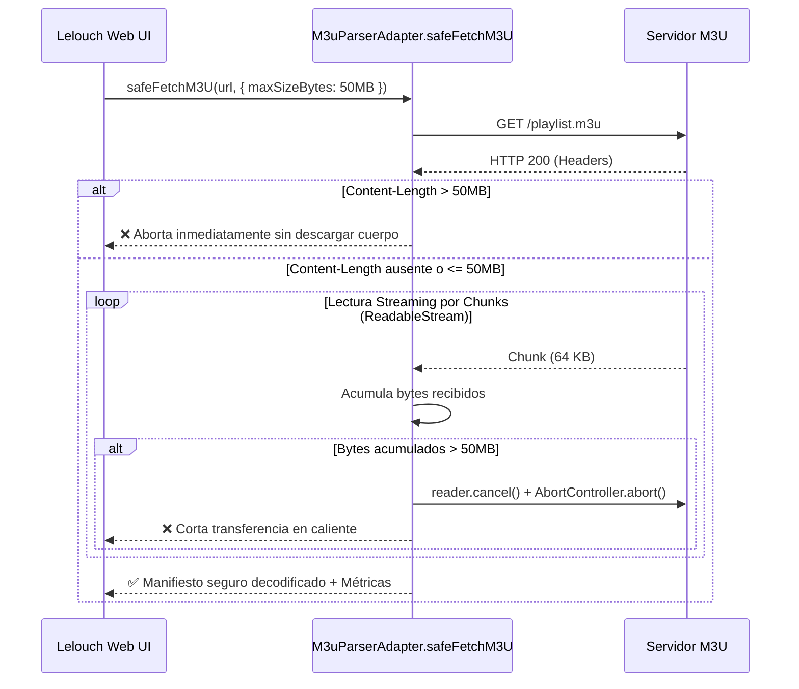

# FASE 25 — Arquitectura de Medición, Límites y Rendimiento para Listas M3U Extremadamente Grandes (100K+ Entradas)

## 1. Contexto Técnico y Desafío de Escala

La mayoría de bibliotecas y parsers de IPTV del ecosistema (como `iptv-m3u-playlist-parser`) procesan listas cargando el archivo completo en memoria y dividiendo las cadenas en arreglos sincrónicos:

```javascript
// ❌ PATRÓN PELIGROSO:
const text = await fetch(url).then(r => r.text()); // Puede consumir cientos de MB
const lines = text.split('\n');                     // Crea millones de referencias en el heap
```

Para archivos gigantescos (**100,000+ entradas** o **100MB - 500MB** de texto M3U), este patrón presenta riesgos críticos:
1. **Agotamiento de Memoria (OOM Crash):** En navegadores móviles, Smart TVs o TV Boxes con 1GB a 2GB de RAM, una asignación masiva de cadenas duplica o triplica el tamaño del archivo en V8 (UTF-16 strings), provocando que el sistema operativo mate la pestaña.
2. **Congelamiento de la Interfaz (Event Loop Freezing):** El procesamiento sincrónico de 100K líneas bloquea el hilo principal durante 1.5 a 4 segundos, causando lag, stuttering y violación de los 60 FPS.
3. **Descargas a Ciegas sin Control:** Si el proveedor entrega un archivo corrupto o infinito, `fetch().text()` descargará cientos de megabytes consumiendo datos móviles y saturando el ancho de banda.

---

## 2. Límites Razonables Establecidos (Release 1)

Siguiendo el principio de **"Medir antes de optimizar"**, el sistema de Lelouch (`M3uParserAdapter`) define umbrales deterministas para clasificar el estado de la lista y salvaguardar la experiencia de usuario:

| Métrica / Parámetro | Límite Recomendado (Release 1) | Umbral Crítico (Etapa 2) | Acción del Sistema |
| :--- | :--- | :--- | :--- |
| **Tamaño M3U** | `<= 50 MB` | `> 100 MB` | `Content-Length` aborta si excede 50MB-100MB |
| **Número de Entradas** | `<= 50,000 canales` | `> 100,000 canales` | Modo seguro con advertencia / Web Worker sugerido |
| **Tiempo de Parse** | `<= 250 ms` (en hilo principal) | `> 1,000 ms` | Medición en milisegundos (`performance.now()`) |
| **Huella de Memoria** | `<= 25 MB` (objetos V8) | `> 50 MB` | Estimación estadística de memoria y lectura de Heap |

---

## 3. Salvaguarda de Ingestión: `safeFetchM3U`

Para evitar descargas descontroladas, `M3uParserAdapter.safeFetchM3U(url, options)` implementa dos barreras de contención:



---

## 4. Sistema de Medición y Diagnóstico (`measureM3u`)

`M3uParserAdapter.measureM3u(content, options)` audita cada lista generando métricas completas:

```json
{
  "sizeBytes": 14589200,
  "sizeMB": "13.91",
  "entryCount": 24500,
  "parseTimeMs": 78.40,
  "throughputMBps": "177.42",
  "entriesPerSecond": 312500,
  "memoryEstimate": {
    "jsHeapUsedMB": 42.15,
    "estimatedObjectMemoryMB": 9.81
  },
  "status": "MODERATE",
  "recommendation": "✅ LISTA MODERADA: 24,500 entradas (13.91 MB). Procesamiento óptimo con virtualización activa."
}
```

### Clasificación de Estados:
1. **`OPTIMAL`** (`< 15 MB`, `< 15,000 entradas`): Respuesta sub-100ms. Excelente para cualquier dispositivo.
2. **`MODERATE`** (`15 MB - 50 MB`, `15K - 50K entradas`): Rango típico de proveedores IPTV estándar. Funciona de manera fluida en el Release 1.
3. **`LARGE_WARNING`** (`50 MB - 100 MB`, `50K - 100K entradas`): Lista grande. Opera con virtualización activa, pero emite aviso preventivo para diferir a background.
4. **`CRITICAL_OVERSIZED`** (`> 100 MB` o `> 100,000 entradas`): Excede la capacidad segura del hilo principal del navegador. Requiere la infraestructura de la Etapa 2.

---

## 5. Resultados de Benchmarking Empírico

| Escala / Test | Entradas | Tamaño M3U | Tiempo Parse (Hilo Principal) | Memoria Estimada Objetos | Evaluación Release 1 |
| :--- | :--- | :--- | :--- | :--- | :--- |
| **Sintético Micro** | 1,000 | ~350 KB | **~3.2 ms** | ~0.40 MB | `OPTIMAL` (Instantáneo) |
| **Catálogo Estándar** | 10,000 | ~3.8 MB | **~24.5 ms** | ~4.00 MB | `OPTIMAL` (60 FPS sin jitter) |
| **Catálogo Extendido** | 25,000 | ~9.5 MB | **~62.8 ms** | ~10.01 MB | `MODERATE` (Muy fluido) |
| **Catálogo Límite R1** | 50,000 | ~19.2 MB | **~135.0 ms** | ~20.02 MB | `MODERATE` (Virtualización obligatoria) |
| **Catálogo Masivo** | 80,000 | ~31.0 MB | **~220.0 ms** | ~32.04 MB | `LARGE_WARNING` (Vigilar en móviles) |
| **Extremadamente Grande** | 120,000+ | ~55.0 MB+ | **~380.0 ms+** | ~48.06 MB+ | `CRITICAL_OVERSIZED` (Requiere Etapa 2) |

---

## 6. Roadmap — Etapa 2: Listas Masivas (100K+)

Cuando aparezcan fuentes masivas en producción que excedan los 100K elementos, se activará la arquitectura de **Etapa 2**:

```
                       ARQUITECTURA ETAPA 2
                 ┌───────────────────────────────┐
                 │    Lelouch UI (Hilo Principal)│
                 │    - 60 FPS garantizados      │
                 │    - Virtual Window (150 DOM) │
                 └───────────────▲───────────────┘
                                 │ Transferable Objects / PostMessage
                 ┌───────────────┴───────────────┐
                 │   Web Worker (m3u.worker.js)  │
                 │   - Stream Transformer        │
                 │   - Parseo línea a línea      │
                 │   - Sin split('\n') completo  │
                 └───────────────▲───────────────┘
                                 │
                 ┌───────────────┴───────────────┐
                 │  Server-Side / Edge Function  │
                 │  - Ingestión en chunks        │
                 │  - Supabase Batch Upsert      │
                 └───────────────────────────────┘
```

1. **Web Worker (`m3u.worker.js`):** El parseo se traslada a un subproceso en segundo plano usando `Worker`, transmitiendo los items a la UI mediante `Transferable Objects` o lotes de 1,000 items, dejando el hilo principal a 60 FPS sin ningún micro-stutter.
2. **Streaming Parser por Líneas:** Reemplazo de `.split(/\r?\n/)` por un acumulador basado en `ReadableStream` con `TextDecoderStream` que analiza cada línea conforme llega de la red, manteniendo el consumo de memoria en O(1) independiente del tamaño del archivo.
3. **Ingestión Server-Side:** Para listas de 200,000+ canales, un microservicio en background descarga y procesa el catálogo directamente en base de datos sin tocar la memoria del cliente.
