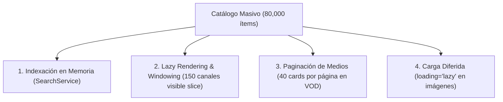

# Arquitectura de Alto Rendimiento: Catálogo Masivo y Generación Eficiente de Playlists

> **Documento de Rendimiento y Escalabilidad — FASE 24**  
> **Proyecto:** Lelouch IPTV & Web Player  
> **Componentes:** Catálogo Frontend, `SearchService`, Serverless `/api/playlist` y Supabase  

---

## 1. El Reto: Catálogos Masivos de 80,000 Elementos

En los proveedores IPTV modernos, la combinación de canales en vivo, películas VOD y episodios de series suele superar los **80,000 elementos**.

### Lo que NO debe ocurrir:
```
80,000 elementos en el catálogo
         │
         ▼
[ERROR CRÍTICO] Crear 80,000 nodos en el DOM
         │
         ▼
Colapso del navegador (Out of Memory, 0 FPS, bloqueo del hilo principal)
```

### Lo que NUNCA debe ocurrir en el Backend:
```
Petición para generar Playlist de 100 canales
         │
         ▼
[ERROR CRÍTICO] SELECT * FROM catalog_items (80,000 registros descargados)
         │
         ▼
catalogo.filter(item => miLista.includes(item.id))  <-- Ineficiente en CPU/RAM
```

---

## 2. Los Cuatro Pilares de Rendimiento en el Frontend



### 1. Indexación en Memoria (`SearchService`)
* Se construye un índice plano (`_liveIndex`, `_moviesIndex`, `_seriesIndex`) **una sola vez** al importar el catálogo.
* Las cadenas de búsqueda se normalizan previamente (`normalizedTitle`, `normalizedCategory`) con NFD, eliminando tildes y mayúsculas.
* Durante la pulsación de teclas, el motor **no recalcula** transformaciones de texto: la búsqueda responde en **menos de 5 milisegundos**.

### 2. Lazy Rendering & Windowing (Live TV)
* La lista de canales en vivo se presenta mediante un corte controlado de ventana:
  ```javascript
  const visibleSlice = channels.slice(0, 150);
  ```
* Se renderizan como máximo 150 elementos interactivos en el DOM simultáneamente, manteniendo la fluidez a 60 FPS.

### 3. Paginación Estricta (VOD / Series)
* Películas y Series utilizan paginación:
  ```javascript
  const PAGE_SIZE_MOVIES = 40;
  const PAGE_SIZE_SERIES = 40;
  ```
* Se evita la creación de decenas de miles de tarjetas VOD; el usuario navega ágilmente mediante controles de página.

### 4. Carga Asíncrona de Imágenes
* Todos los elementos visuales implementan:
  ```html
  
  ```
* El navegador solo descarga carátulas y logotipos cuando entran al área visible de la pantalla (*viewport*).

---

## 3. Generación Específica de Playlists en Supabase

Para entregar una lista M3U (ej. `/api/playlist/TOKEN`), el sistema **consulta única y exclusivamente los items pertenecientes a esa lista**.

```
TV / TiviMate / Dispositivo
        │
        │ GET /api/playlist/<token>
        ▼
Serverless Function (/api/playlist.js)
        │
        │ Consulta con filtro estricto por playlist_id
        ▼
Supabase REST API:
/rest/v1/v_resolved_playlist_items?playlist_id=eq.<UUID>&enabled=eq.true&order=position.asc
        │
        ▼
PostgreSQL (Index Scan):
idx_playlist_items_active (playlist_id, enabled, position ASC)
        │
        ▼
Retorna ÚNICAMENTE los 100-200 items de esa lista (< 5 ms)
```

### Índices de Alto Rendimiento en PostgreSQL:
```sql
-- Búsqueda directa por playlist y posición:
CREATE INDEX IF NOT EXISTS idx_playlist_items_playlist_pos 
    ON public.playlist_items(playlist_id, position ASC);

-- Filtro específico de items activos para generación de M3U:
CREATE INDEX IF NOT EXISTS idx_playlist_items_active 
    ON public.playlist_items(playlist_id, enabled, position ASC);

-- Verificación de estado de la playlist:
CREATE INDEX IF NOT EXISTS idx_custom_playlists_id_enabled 
    ON public.custom_playlists(id, enabled);
```

### Garantía Técnica:
* **Cero sobrecarga de red:** El payload transferido entre Supabase y Vercel es exactamente el tamaño de la playlist del usuario (unos pocos kilobytes), no los megabytes de un catálogo completo.
* **Cero filtrado innecesario en JavaScript:** El motor relacional de PostgreSQL ejecuta el filtrado y ordenamiento en memoria indexada en menos de 5 ms.
