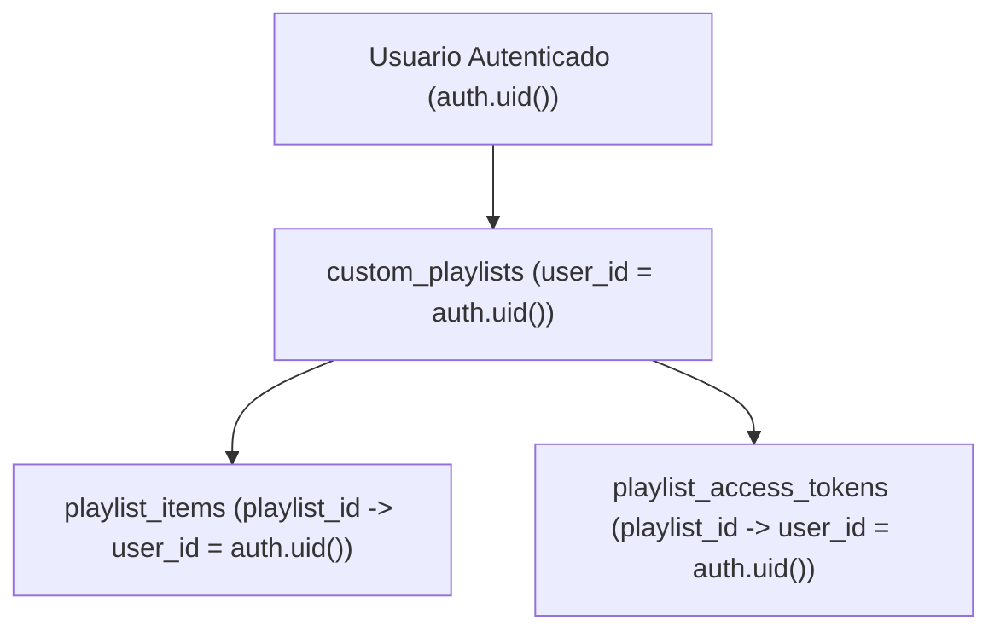

# Arquitectura de Seguridad RLS y Resolución Server-Side

> **Documento de Auditoría y Especificación de Seguridad — FASE 22**  
> **Proyecto:** Lelouch IPTV & Web Player  
> **Ámbito:** Base de Datos Supabase (PostgreSQL), Políticas RLS y Serverless Backend  

---

## 1. Auditoría de las Políticas RLS Preexistentes

En las etapas iniciales de prototipado, las tablas de listas personalizadas operaban bajo políticas permisivas globales:

```sql
-- POLÍTICA PREVIA OBSOLETA (INSEGURA EN MULTIUSUARIO):
CREATE POLICY "Acceso total custom_playlists anon" 
    ON public.custom_playlists FOR ALL TO anon USING (true) WITH CHECK (true);
```

### Riesgos Identificados:
* Cualquier cliente con la clave anónima pública (`anon key`) podía ejecutar `SELECT * FROM custom_playlists` y listar las colecciones de otros usuarios.
* No existía aislamiento de tenencia (*multi-tenancy isolation*).
* Un usuario malintencionado podía modificar o eliminar (`UPDATE` / `DELETE`) items o tokens de otras personas conociendo o adivinando su UUID.

---

## 2. Nuevas Políticas RLS: Usuario Autenticado (`authenticated`)

Se implementó el principio de mínimo privilegio estricto para usuarios autenticados mediante `auth.uid()`:



### A. `custom_playlists`
Un usuario autenticado solo puede ejecutar `SELECT`, `INSERT`, `UPDATE` y `DELETE` sobre sus propias listas:
```sql
CREATE POLICY "custom_playlists_auth_select" ON public.custom_playlists
    FOR SELECT TO authenticated USING (auth.uid() = user_id);

CREATE POLICY "custom_playlists_auth_insert" ON public.custom_playlists
    FOR INSERT TO authenticated WITH CHECK (auth.uid() = user_id);

CREATE POLICY "custom_playlists_auth_update" ON public.custom_playlists
    FOR UPDATE TO authenticated USING (auth.uid() = user_id) WITH CHECK (auth.uid() = user_id);

CREATE POLICY "custom_playlists_auth_delete" ON public.custom_playlists
    FOR DELETE TO authenticated USING (auth.uid() = user_id);
```

### B. `playlist_items`
Los canales y elementos solo son administrables si pertenecen a una playlist propiedad del usuario autenticado:
```sql
CREATE POLICY "playlist_items_auth_all" ON public.playlist_items
    FOR ALL TO authenticated
    USING (playlist_id IN (SELECT id FROM public.custom_playlists WHERE user_id = auth.uid()))
    WITH CHECK (playlist_id IN (SELECT id FROM public.custom_playlists WHERE user_id = auth.uid()));
```

### C. `playlist_access_tokens`
Los tokens de acceso solo pueden ser visualizados, creados, desactivados o revocados por el dueño de la playlist:
```sql
CREATE POLICY "tokens_auth_all" ON public.playlist_access_tokens
    FOR ALL TO authenticated
    USING (playlist_id IN (SELECT id FROM public.custom_playlists WHERE user_id = auth.uid()))
    WITH CHECK (playlist_id IN (SELECT id FROM public.custom_playlists WHERE user_id = auth.uid()));
```

---

## 3. Resolución Server-Side del Endpoint Público (`/api/playlist/<token>`)

### El Dilema del TV Box
Reproductores externos como **TiviMate, VLC, OTT Navigator, Smart TVs o decodificadores Android TV** carecen por completo de integración con el SDK de Supabase:
* No tienen cookies de sesión.
* No cuentan con un token JWT de autenticación de Supabase (`auth.uid()`).
* Su único mecanismo de acceso es la URL que descargan:  
  `https://lelouch-web-player.vercel.app/api/playlist/TOKEN_SECRETO`

### Solución Arquitectónica
La resolución del token **ocurre 100% server-side en Vercel**:

```
TV Box / Reproductor Externo
 │
 │ GET /api/playlist/TOKEN (Sin sesión de Supabase)
 ▼
VERCEL SERVERLESS (api/playlist.js)
 │
 │ 1. Valida formato de token y calcula SHA-256
 │ 2. Consulta segura a Supabase mediante SERVICE_ROLE_KEY
 │    (o función SECURITY DEFINER resolve_playlist_by_token)
 ▼
SUPABASE (PostgreSQL con RLS)
 │
 │ Devuelve items resueltos únicamente para ese token_hash
 ▼
VERCEL SERVERLESS
 │
 │ Serializa a #EXTM3U o JSON manifest
 ▼
TV Box / Reproductor Externo
```

1. **Aislamiento de Credenciales:** La clave `SUPABASE_SERVICE_ROLE_KEY` reside exclusivamente en las variables de entorno del servidor Vercel. Nunca se expone al cliente web ni al TV Box.
2. **Procedimiento Almacenado `SECURITY DEFINER`:**  
   Se creó la función `resolve_playlist_by_token(p_token_hash TEXT)` en PostgreSQL que:
   - Se ejecuta con privilegios del sistema, saltando RLS de forma controlada exclusivamente para el hash verificado.
   - Incrementa de forma atómica el contador de solicitudes (`request_count`) y actualiza `last_accessed_at`.
   - Retorna únicamente los canales de la playlist activa correspondiente.

---

## 4. Modo Borrador Local / Anónimo (Sin Inicio de Sesión)

Para no degradar la experiencia de usuarios que prueban el reproductor web sin registrarse:
* Se habilitaron políticas para el rol `anon` restringidas a registros donde `user_id IS NULL`.
* **Garantía:** Un usuario anónimo **nunca** puede consultar, modificar ni eliminar playlists pertenecientes a usuarios registrados (`user_id IS NOT NULL`).
