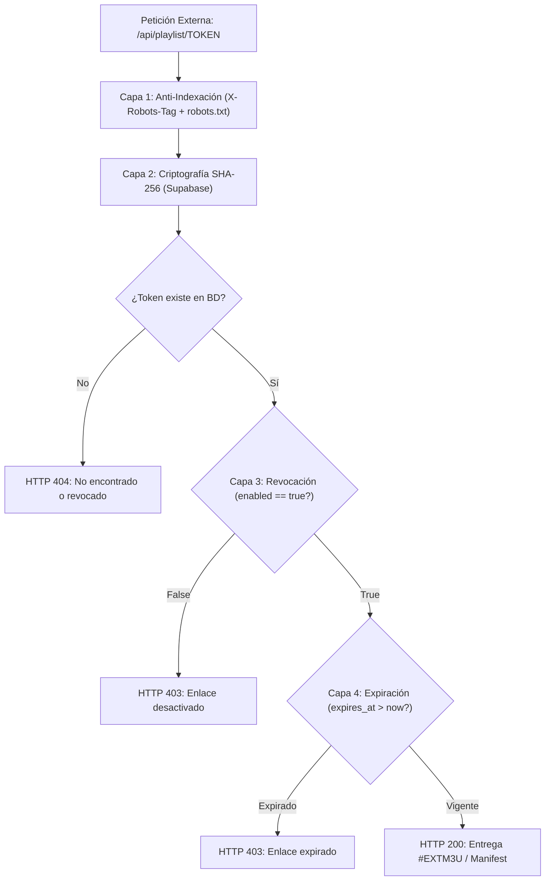

# Seguridad de la URL M3U: El Enlace como Secreto Compartido

> **Documento de Arquitectura y Seguridad — FASE 20**  
> **Proyecto:** Lelouch IPTV & Web Player  
> **Ámbito:** Backend Serverless (`/api/playlist`), Supabase y Cliente Web  

---

## 1. La Realidad Técnica de los Streams IPTV

En los ecosistemas IPTV basados en protocolos Xtream Codes o listas M3U estándar, los proveedores de contenidos emiten streams directos cuyas URLs llevan las credenciales de autenticación incrustadas en el URI o en la query string:

```text
http://linea.proveedor-iptv.com:8080/live/usuario_secreto/contrasena_secreta/12345.ts
http://linea.proveedor-iptv.com:8080/movie/usuario_secreto/contrasena_secreta/98765.mp4
http://linea.proveedor-iptv.com:8080/get.php?username=usuario_secreto&password=contrasena_secreta&type=m3u_plus
```

### ¿Por qué el reproductor externo debe recibir estas URLs?
Reproductores como **TiviMate, VLC, OTT Navigator, Smart TVs (SS IPTV, IPTV Smarters) y Kodi** no disponen de un túnel VPN ni de sesiones web basadas en cookies de sesión de Lelouch. 

Para que estos reproductores puedan solicitar los fragmentos de video MPEG-TS / HLS al proveedor, el archivo generado `#EXTM3U` **debe proporcionar la URL completa del stream**.

---

## 2. Consecuencia Arquitectónica Fundamental

$$\mathbf{URL\ M3U\ Privada} \equiv \mathbf{Credencial\ de\ Acceso\ a\ tu\ Playlist\ y\ Proveedor}$$

* Quien posee el enlace `/api/playlist/<token>` tiene la capacidad técnica de descargar la lista M3U.
* Al descargar la lista M3U, obtiene las URLs de stream que contienen las credenciales del proveedor.
* Por lo tanto:
  1. **El token no es un slug cosmético**: es un **Secreto Compartido (Shared Secret)** de alta entropía.
  2. **La URL nunca debe ser pública** ni compartirse en foros, blogs, repositorios o sitios de terceros.
  3. **Los motores de búsqueda tienen prohibido indexarla**.

---

## 3. Matriz de Defensa y Ciclo de Vida del Token

Para mitigar los riesgos derivados de la naturaleza de secreto compartido, el sistema Lelouch implementa una arquitectura defensiva en 4 capas:



### Capa 1: Revocación Inmediata (Revocar)
* En la interfaz de gestión (*Creador y Gestor de Lista M3U*), el usuario dispone del botón **`[⛔ Desactivar enlace]`**.
* Actualiza atómicamente el campo `enabled = false` en la tabla `playlist_access_tokens` de Supabase.
* A partir de ese milisegundo, cualquier intento de descarga desde TiviMate o VLC recibe:
  - Formato M3U: `HTTP 403 Forbidden` (`#EXTINF:-1,Este enlace M3U ha sido desactivado`).
  - Formato JSON: `HTTP 403 { "error": "Este enlace M3U ha sido desactivado" }`.

### Capa 2: Regeneración e Invalidación de Tokens Previos (Regenerar)
* Si el usuario sospecha que su enlace fue comprometido, compartido involuntariamente o grabado en video, pulsa **`[🔄 Regenerar enlace]`**.
* El sistema:
  1. Llama a `supabaseService.invalidateAllAccessTokens(playlistId)` marcando todos los tokens históricos como inactivos (`enabled = false`).
  2. Genera un nuevo token criptográfico seguro de 40-64 caracteres alfanuméricos (`crypto.getRandomValues`).
  3. Calcula su hash unidireccional **SHA-256** y lo persiste en Supabase.
  4. La URL anterior queda irrevocablemente inutilizada (HTTP 404 / 403).

### Capa 3: Expiración Opcional (`expires_at`)
* La tabla `playlist_access_tokens` incluye la columna nativa `expires_at TIMESTAMPTZ`.
* `SupabaseService.createAccessToken(playlistId, name, expiresInDays)` admite un TTL en días.
* En cada invocación, la Serverless Function `/api/playlist.js` valida:
  ```javascript
  if (tokenRecord.expires_at) {
    const expires = new Date(tokenRecord.expires_at);
    if (expires < new Date()) {
      return res.status(403).json({ error: 'Este enlace M3U ha expirado', status: 403 });
    }
  }
  ```

### Capa 4: Blindaje contra Motores de Búsqueda (Anti-Indexación)
1. **Encabezado HTTP en Vercel Edge y Serverless:**
   Todas las respuestas de `/api/playlist/*` (éxitos `200`, `304` y errores `400`, `403`, `404`, `500`) emiten:
   ```http
   X-Robots-Tag: noindex, nofollow, noarchive, nosnippet
   ```
2. **Directivas en `robots.txt`:**
   ```text
   User-agent: *
   Disallow: /api/
   Disallow: /api/playlist/
   Disallow: /api/playlist/*
   ```
3. **UI Web:**
   El frontend advierte visualmente al usuario con alerta destacada de que el enlace constituye un secreto compartido.

---

## 4. Auditoría de Seguridad de Credenciales en Logs

Para prevenir que las credenciales de los streams aparezcan en los registros de depuración o proveedores de analíticas:
* La función `redactSensitiveUrl(url)` filtra y enmascara:
  - Parámetros `username=***` y `password=***`.
  - Rutas de stream `/live/***/***/***` y `/movie/***/***/***`.
  - Peticiones `get.php?username=***&password=***`.
* Los logs de servidor en Vercel y consola del navegador reciben siempre las cadenas ofuscadas.
* La clave maestra de base de datos (`SUPABASE_SERVICE_ROLE_KEY`) **nunca** se entrega al cliente web; el frontend utiliza exclusivamente `SUPABASE_ANON_KEY` bajo políticas RLS.
